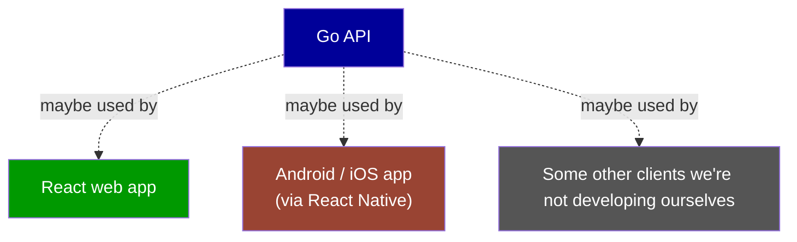
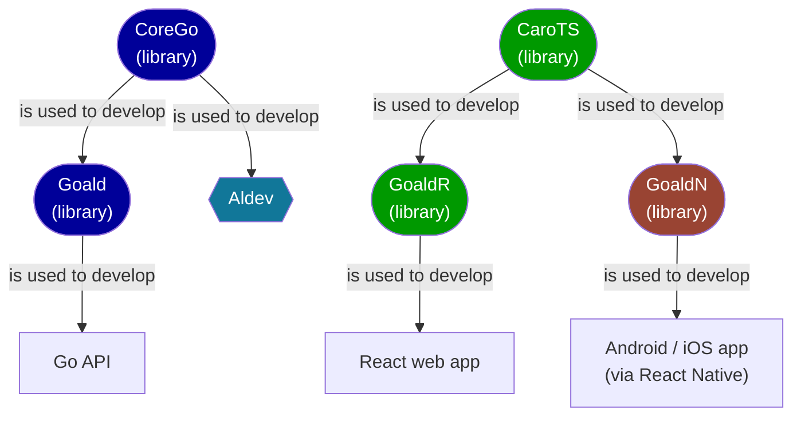

# Introduction

- [Introduction](#introduction)
  - [Components](#components)

**Devotion** is a hybrid fullstack framework that - for now - allows to build _together_ a `Go` API, with maybe a `React`-based web client, and / or maybe a `React Native`-based Android / iOS app client.

So it basically helps developing and deploying this kind of setup:

 

:::info[Important info]
Devotion is made to work on **Unix**-based dev environments.
:::

:::warning
It might only partially work on Windows.
:::

 

[top](#)

---

## Components

**Devotion** can be seen as 1 tool - [Aldev](../2-aldev/index.md) - and 5 libraries working together: [Goald](../3-goald/index.md), [GoaldR](../4-goaldr/index.md), [GoaldN](../5-goaldn/index.md), [CoreGo](../6-corego/index.md) and [CaroTS](../7-carots/index.md):

:::tip[As we'll see later on]
[Aldev](../2-aldev/index.md) is our special tool that helps build, locally and remotely deploy, test, and maintain both the libraries and the apps using them.
:::

 

[top](#)

---
